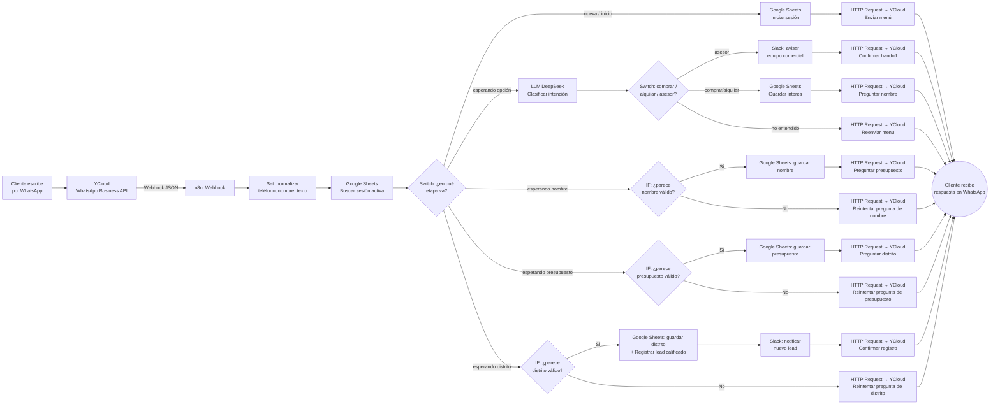
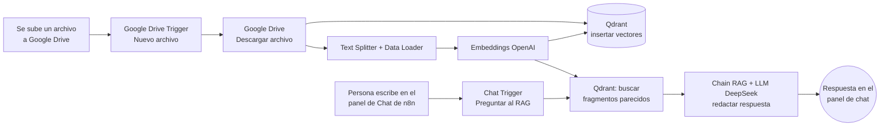

# Flujos extra de la Sesión 3

Estos dos workflows son material educativo adicional, pensado para complementar lo visto en clase.

- **Flujo 1 (`S3-W1`)** está aplicado a un caso de negocio con **WhatsApp Business API (vía YCloud) → Webhook de n8n → lógica → respuesta**.
- **Flujo 2 (`S3-W2`)** es una versión **súper básica de RAG**, sin WhatsApp: usa **Google Drive** como fuente de documentos y el **panel de chat propio de n8n** para preguntar, pensada para entender el mínimo indispensable de un RAG antes de complicarlo con un canal externo.

No usan datos ni credenciales reales: el nombre de empresa del Flujo 1 (InmoLima) es ficticio, pensado solo para la clase.

**Sobre el LLM:** ambos flujos usan **DeepSeek** como modelo de lenguaje (razonar, clasificar, generar texto). Una aclaración importante para la clase: DeepSeek no ofrece un servicio de *embeddings* (los vectores numéricos que representan el significado de un texto para buscarlo luego), así que esa parte específica sigue usando **OpenAI Embeddings** en el Flujo 2. Es un ejemplo real de cómo en producción casi nunca usas un solo proveedor de IA para todo — combinas el mejor para cada tarea.

---

## Flujo 1 — `S3-W1`: Generación y calificación de leads por WhatsApp

**Caso de uso:** InmoLima, una inmobiliaria ficticia inspirada en el caso real de FINCASA que vimos en la sesión. Un cliente le escribe al WhatsApp del negocio. A diferencia de una demo simple, este flujo **no asume que la conversación ya está resuelta**: la reconstruye turno a turno, exactamente como pasaría en la vida real, usando una hoja de Google Sheets ("Sesiones") como memoria de en qué punto va cada conversación.

**¿Por qué es un caso real de WhatsApp?** Porque resuelve el mismo dolor que tiene cualquier negocio que recibe consultas por WhatsApp: la mitad de las conversaciones nunca llegan a nada porque nadie las califica ni las registra a tiempo, y porque los clientes no escriben con las palabras exactas de un menú ("quisiera ver deptos en venta" en vez de "comprar"). Aquí el bot entiende eso, separa "esto es un lead" de "esto quiere un humano ya", y solo molesta al equipo comercial cuando el lead ya tiene los datos mínimos para venderle algo.

**Qué hace paso a paso:**

1. **Webhook** recibe el evento que YCloud reenvía cada vez que llega un WhatsApp al número del negocio.
2. **Set** normaliza el mensaje (teléfono, nombre, texto).
3. **Google Sheets** busca si ese teléfono ya tiene una conversación en curso en la hoja "Sesiones" (si es la primera vez, no encuentra nada y arranca desde cero).
4. **Switch** dirige el turno según en qué etapa va esa conversación: menú inicial, esperando la opción elegida, esperando nombre, esperando presupuesto, o esperando distrito.
5. Cuando el cliente responde al menú, un **LLM (DeepSeek)** lee su mensaje en lenguaje natural y clasifica su intención en comprar / alquilar / asesor / otro — sin depender de que escriba una palabra exacta.
   - Si pidió un asesor → **Slack** avisa al equipo comercial y **WhatsApp** confirma el handoff.
   - Si es un lead → el flujo le pregunta, uno por uno: nombre → presupuesto → distrito.
6. **(Nuevo) Validación de cada respuesta antes de guardarla:** por cada dato (nombre, presupuesto, distrito), un nodo **IF** revisa si la respuesta "parece" válida (ej. el nombre no es un número, el presupuesto trae una cifra, el distrito no está vacío).
   - Si **es válida** → **Google Sheets** la guarda y el flujo avanza a la siguiente pregunta.
   - Si **no es válida** → el flujo **no avanza**: **HTTP Request** reintenta la misma pregunta por WhatsApp hasta que el cliente responda algo que sí pase la validación. Esto evita registrar leads con datos basura (ej. que alguien escriba "ok" donde se esperaba un presupuesto).
7. Al completar los 3 datos validados, **Google Sheets** registra el lead calificado, **Slack** avisa al equipo comercial y **WhatsApp** confirma al cliente.

**Tecnologías que combina:** WhatsApp Business API (YCloud), Webhook, Set, Code, Google Sheets (como memoria de conversación), Switch, IF (validación de respuestas), LLM DeepSeek + Structured Output Parser, Slack, HTTP Request.

---

## Flujo 2 — `S3-W2`: RAG básico — Google Drive a Qdrant y chat en n8n

**Caso de uso:** este workflow no simula ningún negocio en particular. Es el **RAG más simple posible**, pensado para entender el mínimo mecanismo antes de complicarlo con canales externos como WhatsApp: **dos partes independientes** que no dependen ni de Sheets ni de Slack ni de ningún canal de mensajería.

### Parte 1 (arriba): Alimentar la base de conocimiento desde Google Drive

Cuando subes un archivo nuevo a una carpeta de Google Drive, n8n lo procesa e indexa automáticamente:

1. **Google Drive Trigger** detecta que se subió un archivo nuevo a la carpeta vigilada.
2. **Google Drive** descarga ese archivo.
3. El documento pasa por el **Text Splitter** (lo trocea en fragmentos) y el **Default Data Loader** (extrae el texto).
4. **Embeddings (OpenAI)** convierte cada fragmento en un vector numérico.
5. **Qdrant Vector Store** guarda esos vectores en la colección de conocimiento.

### Parte 2 (abajo): Conversar con esa base de conocimiento desde el chat de n8n

Cualquiera que abra el editor puede hacerle preguntas al contenido indexado usando el panel de chat propio de n8n (botón "Chat" en el editor) — no hace falta activar el workflow, porque el **Chat Trigger** tiene su propio botón de prueba:

1. **Chat Trigger** recibe la pregunta escrita en el panel de chat de n8n.
2. **Qdrant Vector Store** (en modo "buscar", no "insertar") usa el mismo modelo de embeddings para encontrar los fragmentos más parecidos a la pregunta.
3. Un **Chain de Retrieval QA** le pasa esos fragmentos + la pregunta a un **LLM (DeepSeek)**, que redacta la respuesta basándose únicamente en lo que encontró — esto es justamente **RAG (Retrieval-Augmented Generation)**: el modelo no memorizó los documentos, los consulta al momento de responder.

**Tecnologías que combina:** Google Drive Trigger, Google Drive, Text Splitter, Data Loader, Embeddings (OpenAI), Qdrant (base de datos vectorial, en modo insertar y en modo buscar), Chat Trigger, Retrieval QA Chain, LLM DeepSeek.

---

## Diferencia clave entre ambos flujos (para explicar en clase)

| | Flujo 1 (leads) | Flujo 2 (RAG básico) |
|---|---|---|
| Canal de entrada | WhatsApp (vía YCloud) | Google Drive (ingesta) + panel de chat de n8n (consulta) |
| Dónde vive la "memoria" | Google Sheets ("Sesiones"), etapa por etapa | Qdrant (los documentos ya indexados) |
| Qué hace el LLM | Clasifica la intención de una respuesta corta (comprar/alquilar/asesor/otro) | Redacta una respuesta larga basada en documentos recuperados (RAG) |
| Notificaciones | Slack avisa al equipo comercial | No tiene — es un flujo mínimo, sin canal de negocio ni auditoría |
| Qué aprende el alumno | Cómo dar memoria a una conversación de WhatsApp sin base de datos tradicional, cómo un LLM reemplaza reglas rígidas de texto, y cómo validar cada respuesta (IF) con un bucle de reintento antes de guardarla | El mecanismo mínimo de un RAG: indexar documentos en un vector store y luego consultarlos, sin la complejidad añadida de un canal externo |

Los dos ilustran extremos distintos: el Flujo 1 es un flujo de negocio completo (WhatsApp → lógica de conversación → CRM → notificación), mientras que el Flujo 2 aísla el patrón de RAG a su forma más simple (fuente de documentos → vector store → chat) para que se entienda antes de conectarlo a un canal como WhatsApp.
