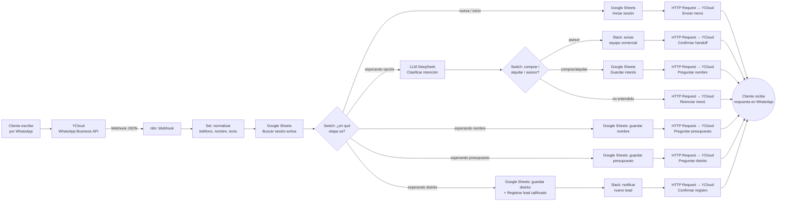
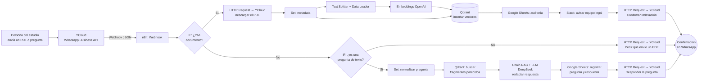

# Flujos extra de la Sesión 3: WhatsApp aplicado a negocio

Estos dos workflows son material educativo adicional, pensado para complementar lo visto en clase. Usan el mismo patrón que ya conoces de la sesión — **WhatsApp Business API (vía YCloud) → Webhook de n8n → lógica → respuesta**— pero aplicado a dos casos de negocio distintos, para que veas cómo el mismo esqueleto sirve para automatizar cosas muy diferentes.

No usan datos ni credenciales reales: los nombres de empresa (InmoLima, Estudio Legal Delta) son ficticios, pensados solo para la clase.

**Sobre el LLM:** ambos flujos usan **DeepSeek** como modelo de lenguaje (razonar, clasificar, generar texto). Una aclaración importante para la clase: DeepSeek no ofrece un servicio de *embeddings* (los vectores numéricos que representan el significado de un texto para buscarlo luego), así que esa parte específica sigue usando **OpenAI Embeddings** en el Flujo 2. Es un ejemplo real de cómo en producción casi nunca usas un solo proveedor de IA para todo — combinas el mejor para cada tarea.

---

## Flujo 1 — `S3-W1`: Generación y calificación de leads por WhatsApp

**Caso de uso:** InmoLima, una inmobiliaria ficticia inspirada en el caso real de FINCASA que vimos en la sesión. Un cliente le escribe al WhatsApp del negocio. A diferencia de una demo simple, este flujo **no asume que la conversación ya está resuelta**: la reconstruye turno a turno, exactamente como pasaría en la vida real, usando una hoja de Google Sheets ("Sesiones") como memoria de en qué punto va cada conversación.

**¿Por qué es un caso real de WhatsApp?** Porque resuelve el mismo dolor que tiene cualquier negocio que recibe consultas por WhatsApp: la mitad de las conversaciones nunca llegan a nada porque nadie las califica ni las registra a tiempo, y porque los clientes no escriben con las palabras exactas de un menú ("quisiera ver deptos en venta" en vez de "comprar"). Aquí el bot entiende eso, separa "esto es un lead" de "esto quiere un humano ya", y solo molesta al equipo comercial cuando el lead ya tiene los datos mínimos para venderle algo.

**Qué hace paso a paso:**

1. **Webhook** recibe el evento que YCloud reenvía cada vez que llega un WhatsApp al número del negocio.
2. **Set** normaliza el mensaje (teléfono, nombre, texto).
3. **Google Sheets** busca si ese teléfono ya tiene una conversación en curso en la hoja "Sesiones" (si es la primera vez, no encuentra nada y arranca desde cero).
4. **Switch** dirige el turno según en qué etapa va esa conversación: menú inicial, esperando la opción elegida, esperando nombre, esperando presupuesto, o esperando distrito.
5. Cuando el cliente responde al menú, un **LLM (DeepSeek)** lee su mensaje en lenguaje natural y clasifica su intención en comprar / alquilar / asesor / otro — sin depender de que escriba una palabra exacta.
   - Si pidió un asesor → **Slack** avisa al equipo comercial y **WhatsApp** confirma el handoff.
   - Si es un lead → el flujo le pregunta, uno por uno y guardando cada respuesta en Sheets: nombre → presupuesto → distrito.
6. Al completar los 4 datos, **Google Sheets** registra el lead calificado, **Slack** avisa al equipo comercial y **WhatsApp** confirma al cliente.

**Tecnologías que combina:** WhatsApp Business API (YCloud), Webhook, Set, Code, Google Sheets (como memoria de conversación), Switch, LLM DeepSeek + Structured Output Parser, Slack, HTTP Request.

---

## Flujo 2 — `S3-W2`: Base de conocimiento por WhatsApp (Qdrant + RAG)

**Caso de uso:** Estudio Legal Delta & Asociados, un estudio de abogados ficticio. El equipo recibe todo el tiempo normativa nueva, contratos modelo y resoluciones en PDF, y hoy se pierden entre los chats de WhatsApp. Este workflow tiene dos mitades que conversan con el mismo número de WhatsApp del estudio.

### Parte 1: Alimentar la base de conocimiento

**¿Por qué es un caso real de WhatsApp?** Porque no todo lo que llega por WhatsApp es una conversación de venta — muchas veces es información que hay que **archivar y hacer buscable**. Esta parte convierte el WhatsApp del estudio en la puerta de entrada de su base de conocimiento.

1. **Webhook** recibe el mensaje de WhatsApp reenviado por YCloud.
2. **IF** revisa si el mensaje trae un documento adjunto.
3. Si trae documento:
   - **HTTP Request** lo descarga desde la API de medios de YCloud.
   - **Set** arma la metadata (quién lo envió, nombre del archivo, fecha).
   - El documento pasa por el **Text Splitter** (lo trocea en fragmentos) y el **Default Data Loader** (extrae el texto del PDF).
   - **Embeddings (OpenAI)** convierte cada fragmento en un vector numérico.
   - **Qdrant Vector Store** guarda esos vectores en la colección de conocimiento legal del estudio.
4. **Google Sheets** registra la auditoría (qué se indexó, quién lo mandó, cuándo), **Slack** avisa al equipo legal, y **WhatsApp** confirma al remitente.

### Parte 2 (nueva): Conversar con esa base de conocimiento por WhatsApp

Esta es la otra mitad: cualquier persona del estudio puede **preguntarle** a la base de conocimiento por el mismo WhatsApp, sin entrar a ninguna otra herramienta.

1. Si el mensaje entrante **no** es un documento, un segundo **IF** revisa si al menos es una pregunta de texto (si no es ni documento ni pregunta, se le pide que envíe un PDF, como antes).
2. **Set** normaliza la pregunta (remitente, texto de la pregunta, fecha).
3. **Qdrant Vector Store** (en modo "buscar", no "insertar") usa el mismo modelo de embeddings para encontrar los fragmentos de documentos más parecidos a la pregunta.
4. Un **Chain de Retrieval QA** le pasa esos fragmentos + la pregunta a un **LLM (DeepSeek)**, que redacta la respuesta basándose únicamente en lo que encontró — esto es justamente **RAG (Retrieval-Augmented Generation)**: el modelo no memorizó los documentos, los consulta al momento de responder.
5. **Google Sheets** registra la consulta (pregunta + respuesta) en una hoja de auditoría ("Consultas"), y **WhatsApp** le devuelve la respuesta a quien preguntó.

**Tecnologías que combina:** WhatsApp Business API (YCloud), Webhook, IF, HTTP Request, Text Splitter, Data Loader, Embeddings (OpenAI), Qdrant (base de datos vectorial, en modo insertar y en modo buscar), Retrieval QA Chain, LLM DeepSeek, Google Sheets, Slack.

---

## Diferencia clave entre ambos flujos (para explicar en clase)

| | Flujo 1 (leads) | Flujo 2 (base de conocimiento) |
|---|---|---|
| Qué recibe por WhatsApp | Texto de un cliente, turno a turno | Un documento (PDF) **o** una pregunta de texto |
| Dónde vive la "memoria" | Google Sheets ("Sesiones"), etapa por etapa | Qdrant (los documentos ya indexados) |
| Qué hace el LLM | Clasifica la intención de una respuesta corta (comprar/alquilar/asesor/otro) | Redacta una respuesta larga basada en documentos recuperados (RAG) |
| A quién avisa Slack | Al equipo comercial | Al equipo legal |
| Qué aprende el alumno | Cómo dar memoria a una conversación de WhatsApp sin base de datos tradicional, y cómo un LLM reemplaza reglas rígidas de texto | Cómo alimentar y luego **consultar** una base de conocimiento (RAG) desde el mismo canal conversacional |

Ambos comparten la misma columna vertebral: **Webhook de WhatsApp → procesar → guardar/consultar → notificar → confirmar**. Ese es el patrón que se repite en casi cualquier automatización de negocio con WhatsApp, cambia solo qué pasa en el medio — y ahora, además, quién razona ese "en el medio": reglas fijas, o un LLM.
